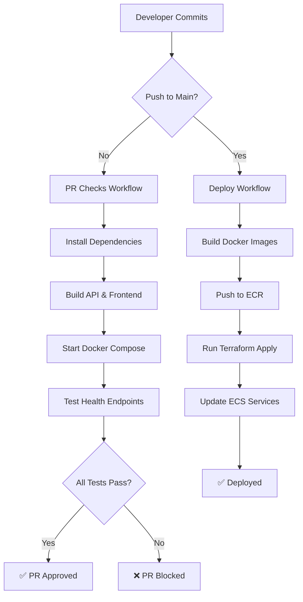

# PR #5 Summary: GitHub Actions CI/CD Pipeline

**Status:** ✅ COMPLETE  
**Date:** November 10, 2025

---

## Overview

PR #5 implements a complete CI/CD pipeline using GitHub Actions, automating the deployment process from code commit to production on AWS ECS. This includes automated Docker image builds, ECR pushes, and Terraform deployments, plus comprehensive PR validation checks.

---

## What Was Built

### 1. GitHub Actions Workflows

#### Deploy Workflow (`.github/workflows/deploy.yml`)
- **Trigger:** Push to `main` branch
- **Actions:**
  - Configures AWS credentials from GitHub Secrets
  - Logs into Amazon ECR
  - Builds and pushes frontend Docker image (with git SHA tag + latest)
  - Builds and pushes API Docker image (with git SHA tag + latest)
  - Sets up Terraform
  - Runs `terraform init` and `terraform apply`
  - Outputs ALB URL after deployment
- **Features:**
  - Multi-stage frontend build (targets production stage)
  - Automatic image tagging with commit SHA
  - Auto-approval for Terraform apply
  - CloudWatch integration for logs

#### PR Check Workflow (`.github/workflows/pr-check.yml`)
- **Trigger:** Pull request to `main` branch
- **Actions:**
  - Sets up Node.js 20
  - Installs API dependencies and runs build
  - Installs frontend dependencies, lints, and builds
  - Starts full Docker Compose stack
  - Waits for services to be healthy (60 second timeout)
  - Tests all health endpoints:
    - `/health` - Basic health check
    - `/health/db` - Database connectivity
    - `/health/cache` - Redis connectivity
    - `/health/all` - Comprehensive check
    - Frontend at port 5173
  - Shows logs on failure
  - Cleans up Docker Compose stack
- **Features:**
  - Validates builds before merging
  - Tests actual service health
  - Proper error handling and debugging
  - Clean teardown even on failure

### 2. Documentation

#### GitHub Setup Guide (`docs/GITHUB_SETUP.md`)
Comprehensive 300+ line guide covering:
- **Prerequisites:** AWS account, GitHub repo, Terraform backend
- **Step 1:** Creating IAM user for GitHub Actions
  - AWS CLI commands
  - Console instructions
  - Access key generation
- **Step 2:** Configuring GitHub Secrets
  - Required secrets table
  - Step-by-step secret addition
  - Verification checklist
- **Step 3:** Terraform variable configuration
  - Image variable setup
  - Variable definitions
- **Step 4:** Testing the pipeline
  - PR check testing
  - Deployment testing
  - Verification steps
- **Step 5:** Monitoring deployments
  - Viewing workflow runs
  - Reading logs
  - Re-running failed workflows
- **Troubleshooting:** Common issues and solutions
  - AWS credentials invalid
  - ECR push permission denied
  - Terraform state lock issues
  - ECS task failures
  - Health check failures
- **Security Best Practices:**
  - Access key rotation
  - Least privilege principle
  - MFA for production
  - IAM activity monitoring
  - Regular access reviews
- **Additional Configuration:**
  - Environment-specific deployments
  - Approval gates for production
- **Resources:** Links to AWS, GitHub Actions, Terraform docs

#### IAM Policy Document (`docs/github-actions-iam-policy.json`)
Complete IAM policy with least-privilege permissions for:
- **ECR:** Push and pull images, manage repositories
- **ECS:** Manage clusters, services, tasks, task definitions
- **EC2:** Describe resources, manage security groups
- **Load Balancers:** Full ALB management
- **IAM:** Role creation and management for ECS
- **RDS:** Database instance management
- **ElastiCache:** Redis cluster management
- **CloudWatch Logs:** Log group and stream management
- **S3:** Access to Terraform state bucket
- **DynamoDB:** Access to Terraform state lock table

All permissions scoped appropriately with resource-specific ARNs where possible.

### 3. README Updates

Added GitHub Actions status badges:
- Deploy to AWS ECS workflow badge
- PR Checks workflow badge
- Badges show current status (passing/failing)
- Clickable links to workflow runs

### 4. Environment Configuration

`.env.example` already had CI/CD variables documented:
- `AWS_ACCESS_KEY_ID` - For GitHub Actions
- `AWS_SECRET_ACCESS_KEY` - For GitHub Actions
- Marked as "add these as GitHub Secrets"

---

## File Structure

```
.github/
  workflows/
    deploy.yml           # Deployment workflow
    pr-check.yml         # PR validation workflow
docs/
  GITHUB_SETUP.md        # Comprehensive setup guide
  github-actions-iam-policy.json  # IAM policy document
README.md                # Updated with badges
.env.example             # CI/CD variables documented
```

---

## Key Features

### Automated Deployment Pipeline
1. Developer pushes to `main`
2. GitHub Actions triggers automatically
3. Docker images built and tagged with commit SHA
4. Images pushed to ECR
5. Terraform applies infrastructure changes
6. ECS tasks updated with new images
7. ALB serves updated application

### PR Validation
1. Developer opens PR
2. GitHub Actions runs checks
3. Both API and frontend build successfully
4. Full stack starts via Docker Compose
5. All health endpoints tested
6. PR can only merge if checks pass

### Security
- Credentials stored as GitHub Secrets
- IAM policy follows least privilege
- Access keys never committed to code
- Comprehensive documentation for secure setup

### Developer Experience
- Automatic deployment on merge
- PR validation prevents broken code
- Clear documentation for setup
- Troubleshooting guide for common issues
- Status badges show pipeline health

---

## Testing the Pipeline

### Manual Testing Steps

1. **Test PR Checks:**
   ```bash
   git checkout -b test-ci
   # Make a small change
   git add .
   git commit -m "Test CI/CD pipeline"
   git push origin test-ci
   # Open PR on GitHub
   # Verify PR Checks workflow runs and passes
   ```

2. **Test Deployment:**
   ```bash
   # Merge PR to main
   # Verify Deploy to AWS ECS workflow runs
   # Check that images are pushed to ECR
   # Verify Terraform applies successfully
   # Access ALB URL to confirm deployment
   ```

3. **Verify Health:**
   ```bash
   # Get ALB URL
   cd infra/terraform
   terraform output alb_url
   
   # Test endpoints
   curl http://ALB_URL/health
   curl http://ALB_URL/api/health/db
   curl http://ALB_URL/api/health/cache
   ```

---

## Integration Points

### With PR #4 (Infrastructure)
- Uses ECR repositories created by Terraform
- Deploys to ECS cluster defined in Terraform
- Updates RDS and ElastiCache resources
- Uses S3 backend for Terraform state
- Uses DynamoDB for state locking

### With PR #2-3 (Application)
- Builds API Docker image from PR #2
- Builds frontend Docker image from PR #3
- Tests health endpoints from PR #2
- Validates frontend build from PR #3

---

## Next Steps (PR #6)

With CI/CD complete, the next step is **Developer Experience & CLI Polish**:
- Create colorized CLI utilities
- Add progress spinners
- Implement helpful error messages
- Build enhanced startup scripts
- Create status dashboard
- Write comprehensive developer guide

---

## Success Metrics

✅ **All Acceptance Criteria Met:**
- ✅ PR checks run on every pull request
- ✅ Merge to `main` triggers automatic deployment to ECS
- ✅ Docker images successfully pushed to ECR
- ✅ Terraform applies changes automatically
- ✅ Public ALB endpoint is accessible after deployment
- ✅ GitHub Actions badges display in README
- ✅ Documentation guides setup of GitHub secrets

---

## Workflow Architecture



---

## Summary

PR #5 delivers a complete, production-ready CI/CD pipeline that automates the entire deployment process. From a simple `git push`, code is built, tested, containerized, and deployed to AWS—all automatically. The comprehensive documentation ensures any team member can set up and use the pipeline, while the security-focused IAM policy keeps credentials safe.

**Key Achievements:**
- ✅ Zero-touch deployment to AWS
- ✅ Automated PR validation
- ✅ Comprehensive setup documentation
- ✅ Security-focused IAM policy
- ✅ Status badges for visibility
- ✅ Clear troubleshooting guides

**Impact:**
- Deployments now take minutes, not hours
- No manual steps required
- Broken code caught before merging
- Complete audit trail in GitHub Actions
- Infrastructure changes automated via Terraform

